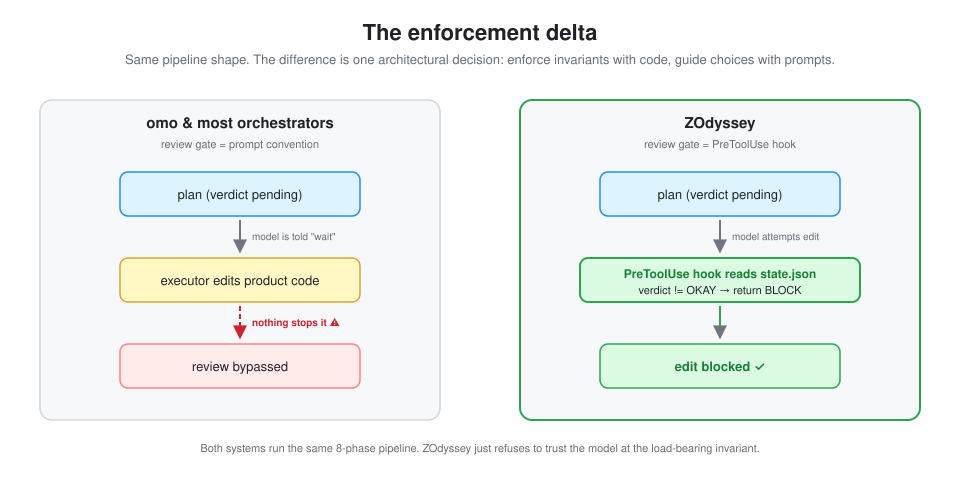
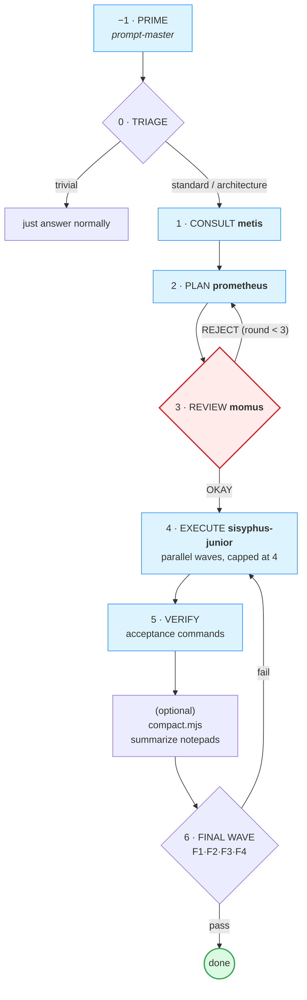
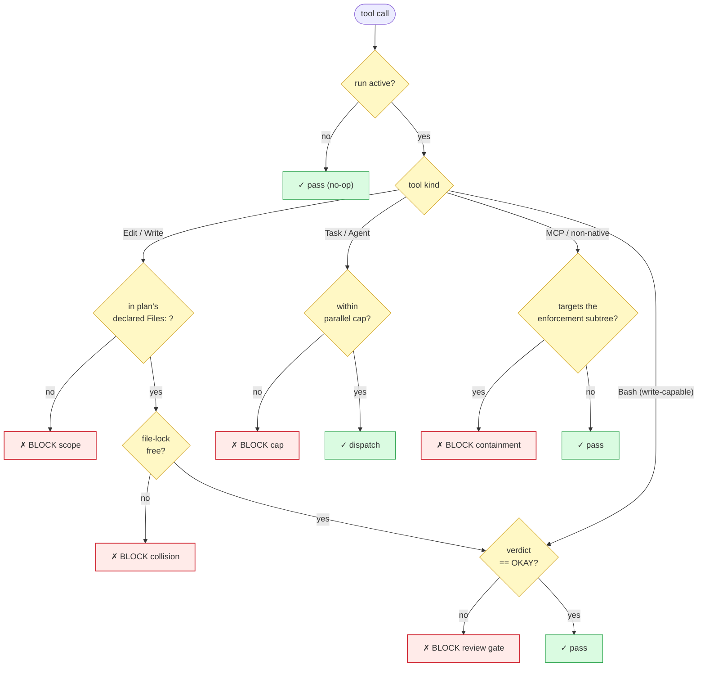
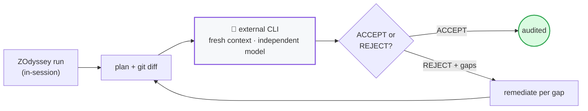

# ZOdyssey

> A hybrid-enforced multi-agent orchestration pipeline. The pattern is portable; the reference implementation targets [ZCode](https://z.ai).

**What if the "review the plan before executing" step in your agent pipeline was a hard gate, not a suggestion?**

That is the core idea. Most multi-agent orchestrators (including the excellent [**omo**](https://github.com/code-yeongyu/oh-my-openagent), which this project learned from) implement the review/approval gate as a prompt convention — the model is *told* not to edit before review passes, but nothing actually stops it. ZOdyssey code-enforces that gate with a hook, and adds a scope-isolation boundary so an executor can only touch files the plan declared. The full pipeline (prime → triage → consult → plan → review → execute → verify → final-wave) is the same shape omo and others use; the enforcement layer is the delta.

<p align="center">
  
</p>

*Both sides run the same pipeline. The right side just refuses to trust the model at the load-bearing invariant.*

---

## Two ways to use this repo

### 1. You just want the ideas (any harness)

Read [`docs/DESIGN.md`](docs/DESIGN.md) — it explains the hybrid-enforcement principle, the plan-file contract, the state/resume model, and every load-bearing decision with the research it is grounded in. Then read [`docs/ADAPT.md`](docs/ADAPT.md) for a concrete guide to porting the enforcement delta onto omo or any orchestrator that supports hooks (Claude Code, ZCode, Cursor, etc.). The source of the gate itself ([`skills/odyssey/hooks/pre-tool.mjs`](skills/odyssey/hooks/pre-tool.mjs)) is the reference implementation to crib from.

**If you are already an omo user, start there** — omo gives you the full pipeline, the agent cast, and the ergonomics. Then layer on the 4 enforcement hooks from [`docs/ADAPT.md`](docs/ADAPT.md). That is the highest-leverage path for most people.

### 2. You are on ZCode and want it ready-to-run

Install the reference implementation:

```bash
git clone https://github.com/amartinawi/zodyssey.git
cd zodyssey
node scripts/install.mjs            # configures pipeline MCPs + AGENTS.md + purges legacy state
```

Then install the plugin itself via the ZCode marketplace (it owns the cache + the manifest, including the enforcement hooks): **Settings → Plugin Management → Discover → `+` → local directory →** `<path>/zodyssey` **→ Get on zodyssey**. Hooks are declared in `.zcode-plugin/plugin.json` and load automatically — no `config.json` surgery.

Then start a new ZCode session and run, in any repo:

```
/orchestrate <your task>
```

Full install/troubleshooting/config in [`docs/INSTALL.md`](docs/INSTALL.md).

---

## The pipeline



*The conductor drives this state machine; every transition checkpoints to `state.json` so a crashed run resumes.* Full topology + agent roles in [`docs/diagrams.md`](docs/diagrams.md).

```
  -1  PRIME        prompt-master refines the raw task into a sharp brief
   0  TRIAGE       trivial → just answer; standard → single-track; architecture → full pipeline
   1  CONSULT      metis classifies intent, surfaces questions/risks
   2  PLAN         prometheus writes <repo>/.zcode/plans/<slug>.md  (cannot edit product code)
   3  REVIEW       momus returns OKAY | REJECT + blockers   ←  THE ENFORCED GATE
   4  EXECUTE      sisyphus-junior per todo, parallel-by-default, scope-locked to the plan's Files:
   5  VERIFY       run each todo's executable acceptance criteria
      (optional)  compact.mjs — summarize notepads so F1–F4 consume a brief, not the full doc set
   6  FINAL WAVE   F1 plan-compliance · F2 code-quality · F3 manual-QA · F4 scope-fidelity
```

The orchestrator (main agent) drives this; the cast of sub-agents (`metis`, `prometheus`, `momus`, `sisyphus-junior`, plus read-only `explore`/`librarian`/`oracle`) does the work. The enforcement hooks are declared in `.zcode-plugin/plugin.json` under `hooks` (resolved via `${CLAUDE_PLUGIN_ROOT}`) and hard-block the invariants.

## What the hooks enforce (the delta)



*First match wins; every other branch blocks.* The MCP/non-native arm landed in v0.5.4 — it is the tool class that could otherwise rewrite the gate itself from inside an approved run. Full decision tree (including the plan-tamper sha guard + the trusted-script allowlist) in [`docs/diagrams.md`](docs/diagrams.md).

| Invariant | How omo does it | How ZOdyssey does it |
|---|---|---|
| **No edits before plan passes review** | prompt convention | hook reads `state.json`; blocks the Edit |
| **Executor stays in declared scope** | not enforced | hook parses the plan's `Files:` union; blocks edits outside it. **Fails closed** on unreadable/empty plan |
| **No edit collisions between agents** | not enforced | hook checks a file-lock ledger |
| **Parallel dispatch within bounds** | not enforced | hook counts in-flight Tasks; blocks beyond cap (default 4) |
| **Bash write-escape before review** | n/a | hook gates write-capable Bash (`sed -i`, `>`, `git apply`, …) the same as Edit. Secure by default; `ZODYSSEY_UNGATE_BASH=1` disables (every ungated call is recorded in run state) |
| **Embedded-dispatch injection** (SEC-1s, [v0.2.0](CHANGELOG.md#020---2026-08-11)) | n/a | hook blocks a `Task()` dispatch whose prompt payload embeds a serialized nested tool call — both `{"tool_name":"Task"}` and Claude-native `{"type":"tool_use","name":"Task"}` shapes. Defense-in-depth behind the harness tool-grant boundary. |
| **Review verdicts are read, not assumed** | prompt convention | F2/F4 parse the artifact's verdict. Ambiguous or absent → `missing` → **fails**. The nonce is minted only for the exact declared minter type, never for a lookalike namespace. Previously they confirmed a nonce and never opened the file |
| **Tests can't be weakened to pass** | not enforced | F1 fails on a deleted test file, a net-negative test-file line count, or a newly added `skip`/`only`/`xfail`. Test files are read-only during `verify`/`final` |
| **The declared work actually happened** | not enforced | F1 checks the converse: a plan declaring files against an empty diff fails instead of passing vacuously |
| **Evidence can't be destroyed** | not enforced | notepads are append-only — `Write` over an existing one is blocked, `Edit` is not |
| **`done` requires executed evidence** | not enforced | `record-todo` refuses `done` without passing `verify.history` records; `--force-done` is allowed but stamps `forced: true` |
| **No pass-to-pass regressions** | not enforced | ⚠️ **still half-wired — see note below.** The suite is snapshotted at review-record (`record-review.mjs:295`) and entering `execute` (`set-phase.mjs:339`), and `set-phase … done` refuses on both `regressed` and `toolchain-drift` (`set-phase.mjs:131`, `set-phase.mjs:137`) — a refusal is not a pass. But **nothing invokes `--check`**, the only path that writes either value, so the comparison never runs and both clauses guard a field nothing sets. An already-red suite is never blamed on the run |
| **Imports resolve** | not enforced | `check-imports.mjs` flags packages in neither the manifest nor `node_modules`, offline, exiting 9. **Wired both sides in v0.6.0** (queue item 02): invoked at verify entry (`set-phase.mjs:380`), recorded to `state.imports`, consumed by a `done` refusal on `status === "unresolved"` (`set-phase.mjs:152`). `inert` and a missing lane still pass, so it cannot wedge a repo it can't evaluate |
| **No retrying an unchanged workspace** | not enforced | `record-verify` refuses to re-run a criterion whose worktree is byte-identical to its last failure (exit `10`). Ported from prime-agent |
| **Citations still point where they claim** | not enforced | every number of every citation shape — single lines, ranges, comma chains, slash and bare-colon continuations — is range-checked and content-pinned in `scripts/anchors.lock.json` (532 citations across 61 docs, measured 2026-08-19 post-re-baseline; one `--update` re-baseline per release re-pins them after at-source verification). Citations into `CHANGELOG.md` are content-pinned like any other target: its top section is scanned while released history below the second version heading stays frozen, and `check-anchors.test.mjs` fails `npm test` when a cited line changes. Pins content, not line numbers, so an in-place edit is caught too. The lock proves *unchanged since seeding*, never *correct*: re-seeding a citation whose meaning moved silences it |
| **Non-native tools can't write the enforcement surface** (v0.5.4) | n/a | Edit and Bash were already gated, leaving MCP/non-native tools as the last class that could rewrite the gate from inside an approved run. The H3 guard in `pre-tool.mjs` blocks them from `skills/odyssey`, `agents`, `commands`, the manifest and the hook registry. Read-only MCPs and ordinary repo work are unaffected |
| **Every run records who verified it** (v0.6.0) | not enforced | each run-report and trend record carries `verify_origin` (`external-audit` \| `in-session-only`) plus `consult_rounds`. Labeling only, no gate — but an externally audited run and a self-graded one are no longer indistinguishable in the corpus |
| **Reviewer reliability is measured, not assumed** (v0.6.0) | not enforced | `registry-report.mjs` folds consult verdicts + judge criterion results into a cross-run trust ledger keyed on agent-file content hashes, so editing a prompt creates a new identity rather than inheriting its predecessor's record. Laplace-smoothed with `n` always shown; advisory-only |
| **The metrics corpus holds real runs only** (v0.6.1) | n/a | `ZODYSSEY_EVAL_LANE=synthetic`, declared at source, routes fixture scorecards to `results.synthetic.jsonl`; the operator lane takes real runs. Before this, 83.2% of the trend log was fixtures being read as evidence |
| **Absent telemetry explains itself** (v0.6.3) | n/a | `collectRunTokens` returns `{inert:true, reason, node_version, at}` over a closed reason set instead of a bare null, so a dead collector is distinguishable from a healthy one. Attribution upgrades to session-exact when the orchestrator session id was witnessed. Needs **Node ≥ 22.5** for `node:sqlite`; below that the record says `binding-unavailable` rather than going quiet |

> **⚠️ One row above is still not enforced — was two, corrected 2026-08-19.** Queue item 02 shipped
> in **v0.6.0** and wired `check-imports`, `coverage-delta` and `resolve-capabilities` the two-sided
> way a gate needs: an invoke *and* a consumer that refuses on what it recorded. The "Imports
> resolve" row is now a guarantee.
>
> `regression-gate.mjs --check` was **not** in item 02's scope and still has **zero code callers**.
> `--snapshot` runs from two sites, but nothing ever compares, so the two `done` refusals at
> `set-phase.mjs:131` and `set-phase.mjs:137` guard a field only `--check` can write. The source
> says so itself at `set-phase.mjs:146`: *"an invoke whose recorded state nothing consumes is the
> half-wiring the regression gate shipped with."* Every other row in this table is hook- or
> script-enforced on the path to `done`.
>
> This is the difference between *shipping a mechanism* and *wiring it*, and it is the exact class
> the table exists to claim ZOdyssey has solved. Treat that one row as a capability you must
> invoke, not a guarantee you receive.

All hooks are **NO-OP unless an orchestration run is active**. Normal ZCode editing is never affected. A run is "active" only between `/orchestrate` and reaching a terminal phase (`done`/`audited`/`abandoned`/`blocked`), and only inside the repo where you invoked it.

## The external consult gate (the strongest check)



After a run reaches `done`, `/orchestrate-consult <slug>` hands the plan + the full git diff to a **separate Claude CLI process** (fresh context, independent model) for an ACCEPT/REJECT audit. It cannot inherit the run's assumptions, so it catches things in-session reviewers miss. Remediation runs after `done`, where the hooks are **disarmed**; the conductor loops per gap until ACCEPT and can optionally set `phase: remediate` (re-arming the gates) when it wants hard enforcement during gap-fixes. See [`docs/DESIGN.md` §6.1](docs/DESIGN.md).

## Prerequisites

There are **two paths** and the prerequisites differ. Pick one, then install in the order listed.

### Path A — Adapt the enforcement delta onto another harness (omo, Claude Code, Cursor, …)

You already have an orchestrator and want to bolt on the 4 enforcement hooks. This is the porting path described in [`docs/ADAPT.md`](docs/ADAPT.md). Install in this order:

1. **An orchestrator with a hook system.** ZOdyssey's delta is `PreToolUse` / `PostToolUse` / `Stop` hooks that return `pass` or `block`. Your harness must run a script before tool calls and honor that decision. [omo](https://github.com/code-yeongyu/oh-my-openagent) (TypeScript), Claude Code, and ZCode all qualify.
2. **Node 18+** on the machine that runs the hooks. All ZOdyssey scripts are ESM `.mjs` using only Node built-ins (`fs`, `path`, `crypto`, `child_process`) — **zero npm dependencies**, so no `npm install` step. Enforcement needs nothing newer; **token telemetry** additionally wants **Node ≥ 22.5** for `node:sqlite`, and below that floor the run record reports `binding-unavailable` instead of silently omitting counts.
3. **A `PreToolUse` hook registration mechanism.** You need a way to tell your harness "run `pre-tool.mjs` before `Write|Edit|ApplyPatch|MultiEdit|NotebookEdit|Bash|Task|Agent`." On ZCode this is `~/.zcode/cli/config.json`; on Claude Code it's `.claude/settings.json`; on omo it's the TS hook layer. See [`docs/ADAPT.md` § "Porting to omo specifically"](docs/ADAPT.md).
4. **A hook scripting language that can read JSON from stdin and exit with a code.** The reference implementation is Node; if your harness prefers Python or Bash, port the logic (it's ~200 lines) — the decision tree is what matters, not the language.

That's the full mandatory set for Path A. The 4 hooks are the entire delta; everything else (agent cast, pipeline shape, notepad pattern) comes from your existing orchestrator.

### Path B — Install the ready-to-run reference implementation on ZCode

You want the full ZOdyssey pipeline (conductors, sub-agents, slash commands) working out of the box. Install in this order:

1. **[ZCode](https://z.ai)** — the hooks, commands, and sub-agents are ZCode primitives. Start a ZCode session first; everything else installs into `~/.zcode/`.
2. **Node 18+** (for the hooks + scripts, all ESM `.mjs`). **Node ≥ 22.5** if you want token telemetry — `node:sqlite` is how run-close reads usage; on an older Node the record names the missing binding rather than going quiet.
3. **A coding model that follows multi-step instructions.** Developed against GLM-5.2, now run against GLM-5.3, via the Z.ai coding plan. Claude / GPT / Gemini class models work too, as long as ZCode can dispatch them as sub-agents.
4. **Clone this repo and run the installer:**
   ```bash
   git clone https://github.com/amartinawi/zodyssey.git
   cd zodyssey
   node scripts/install.mjs            # configures MCPs + AGENTS.md + purges legacy state
   node scripts/install.mjs --verify   # health-check: manifest hooks parse, MCP backends resolvable, no orphans
   node scripts/smoke-gate.mjs         # is enforcement actually LIVE? (see below)
   ```

   **Run the smoke gate before trusting a release.** v0.3.0 shipped with the entire enforcement
   chain offline — every file correct, hooks registered at a path the marketplace install never
   populated — and `--verify` reported green throughout, because it checked files, paths, and
   registration rather than liveness. `smoke-gate.mjs` checks what `--verify` structurally cannot:
   that the **deployed hook bytes match your source** (a stale cache silently runs different code),
   and that the deployed hook actually blocks a pre-OKAY edit when invoked. It then scaffolds a
   throwaway repo for the one check no script can perform — a live ZCode session attempting an edit
   and being refused. `zcode` is a compiled binary, so `${CLAUDE_PLUGIN_ROOT}` resolution and
   manifest-hook honouring are not statically decidable by any tool or auditor; only a live session
   settles it. Two minutes, and it is the exact check whose absence cost v0.3.0.
   ```
   Then install the plugin itself via the ZCode marketplace (**Settings → Plugin Management → Discover → `+` → local directory →** this repo **→ Get zodyssey**) — the marketplace owns the cache copy + `installed_plugins.json` entry + the manifest. The 4 enforcement hooks ship in `.zcode-plugin/plugin.json` under `hooks` (via `${CLAUDE_PLUGIN_ROOT}`, so they track the cache location automatically); the installer no longer writes hooks into `config.json`. It does **purge any pre-v0.3.0 top-level copies** in `~/.zcode/skills|agents|commands/`, migrate any v0.3.0 orphaned hook refs out of `config.json`, and register the 5 pipeline MCPs (`memory`, `sequential-thinking`, `codegraph`, `chrome-devtools`, `zai-mcp-server`) — each gated on its backend being on PATH. Every component is namespaced `zodyssey:` (e.g. the conductor loads as `zodyssey:odyssey`, agents dispatch as `zodyssey:sisyphus-junior`); see the [v0.3.0 CHANGELOG entry](CHANGELOG.md#030---2026-08-11) for the full namespacing map. It detects the [`superpowers`](https://github.com/obra/superpowers) plugin (source of most routed skills) and prints a pointer if missing. Full install / troubleshooting / config in [`docs/INSTALL.md`](docs/INSTALL.md).

### For LLM agents

If you are an LLM agent asked to install ZOdyssey, fetch the full install guide and follow it end to end:

```bash
curl -fsSL https://raw.githubusercontent.com/amartinawi/zodyssey/main/docs/INSTALL.md
```

The guide covers: the prerequisite check (Node 18+, a working ZCode session), the marketplace install (Settings → Discover → add the repo as a local directory → Get zodyssey), the `zodyssey:` namespacing, manifest-declared hooks, MCP registration, AGENTS.md merge, eval-dir init, superpowers detection, the `--verify` health check, and troubleshooting. Then install + run the installer itself (`git clone` + `node scripts/install.mjs` + the GUI Get step) and report the `--verify` output. Don't summarize the guide; read it end to end before doing anything.

### Optional — for specific features (graceful no-op if absent)

These are **not** required for the core pipeline. Each degrades honestly when missing:

- **`git`** — needed for the strongest verification features: the external consult audit (`/orchestrate-consult`) diffs the run against `git rev-parse HEAD`, and final-wave F1 (plan-compliance) is a `git diff --name-only` set-difference. Without git, the pipeline still runs to completion but consult works from the whole working tree and F1 fails-closed (run stays at `phase: final`, not `done`). Most users have git already.
- **A second CLI for the external consult gate** — `consult.mjs` and `judge.mjs` spawn an independent auditor (default binary: `claude`; override with `CLAUDE_CLI`). Set this if you want the `/orchestrate-consult` post-done audit or the eval harness's LLM-as-judge. Without it, the in-session review gate + final wave still run; you lose only the independent-model verification.
- **[codegraph](https://github.com/colbymchenry/codegraph)** — used by `codegraph-impact.mjs` to derive declared `Files:` from real call-graph impact, and by the explore step. Graceful no-op if no `.codegraph/` index is present in the target repo.
- **[`superpowers`](https://github.com/obra/superpowers)** — for the brainstorming / TDD / systematic-debugging skills the conductor reaches for. ZOdyssey works without it; you get the capsule versions of the three load-bearing skills (`tdd`, `debugging`, `executing-plans`) shipped in `references/capsules/` either way.
- **A second provider CLI** (e.g. a different model's `*-p` headless binary) — for `--multi-auditor` consult mode. Set `CLAUDE_CLI_2` to a different provider's CLI and the consult gate runs two independent passes, flagging disagreement.

## What it is NOT

- **Not a replacement for normal agent operation.** It is an opt-in mode entered via `/orchestrate`. Everything else is handled directly.
- **Not multi-model in v1.** The `category` routing field is designed in (see [DESIGN.md §8](docs/DESIGN.md)) but routing reduces to effort/variant selection within one connected model until you wire a second provider.
- **Not harness-agnostic in v1.** The reference implementation targets ZCode. The *pattern* is portable — see [`docs/ADAPT.md`](docs/ADAPT.md).
- **Not a team-mode orchestrator yet.** Parallel multi-executor (mailbox + worktrees) is designed but deferred to v2. v1 is single-executor-per-todo, dispatched in parallel waves.

## Project layout

```
zodyssey/
├── skills/odyssey/          # the conductor: SKILL.md + hooks/ + scripts/ + references/
│   ├── hooks/pre-tool.mjs   #  THE enforcement gate (the delta)
│   └── scripts/             # scaffold, parse-plan, set-phase, consult, record-*, harness, judge…
├── agents/                  # metis, prometheus, momus, sisyphus-junior, explore, librarian, oracle, multimodal-looker
├── commands/                # /orchestrate, /orchestrate-consult
├── docs/
│   ├── DESIGN.md            # the full design doc — read this first
│   ├── ADAPT.md             # porting the enforcement delta onto omo / any harness
│   ├── INSTALL.md           # detailed install + config + troubleshooting
│   ├── diagrams.md          # every architecture diagram (Mermaid, no build step)
│   ├── impl/                # the v0.6 build queue: 00-INDEX.md + one brief per item
│   └── ISNAD.md, ECOSYSTEM_GRAPH.md, MEASUREMENT.md, RESUME.md, ROADMAP.md, deep-audit-prompt.md
├── examples/                # one anonymized example run
└── scripts/install.mjs      # the installer
```

## Provenance

ZOdyssey is a synthesis of published multi-agent systems research, not an invention. Every load-bearing decision maps to a finding from production systems — the [Anthropic multi-agent research post](https://www.anthropic.com/engineering/multi-agent-research-system), the [Building Effective Agents](https://www.anthropic.com/engineering/building-effective-agents) essay, [LangChain's multi-agent architecture analysis](https://www.langchain.com/blog/choosing-the-right-multi-agent-architecture), the [arXiv context-engineering paper](https://arxiv.org/html/2508.08322v1), and the [omo](https://github.com/code-yeongyu/oh-my-openagent) source (the pipeline shape and the agent cast are modeled on omo; the enforcement layer is the differentiator). Full citations in [DESIGN.md §0 + §15](docs/DESIGN.md).

### prime-agent

[PrimeIntellect-ai/prime-agent](https://github.com/PrimeIntellect-ai/prime-agent) is the second direct source. Its 9 primitives were studied in [v0.2.0](CHANGELOG.md#020---2026-08-11) and the decision was **adapt-ideas, not adopt-as-is**: 6 of the 9 require a long-lived daemon ZOdyssey does not have, so only 3 fit a synchronous single-session model.

**Taken:**

| Primitive | Where it landed |
|---|---|
| Notepad compaction (#8) | `scripts/compact.mjs` — concatenates notepads into one brief the F1–F4 reviewers read instead of the full doc set. Deterministic, $0, never mutates the sources |
| Bounded recursion (#4) | the SEC-1s dispatch guard in `hooks/pre-tool.mjs` — blocks a `Task()` whose payload embeds a serialized nested tool call |
| Structured resume (#1) | `state.acceptance` + `state.notepad_pointers`, so a resumed run skips verified todos and re-enters with the right context |

**Deliberately not taken** — daemon-backed session survival, persistent goals, the three heartbeat surfaces, agent-to-agent messaging, and autonomous mode. Each needs a supervisor process that outlives the session. Adopting them would mean adding a runtime layer to gain features the enforcement model does not depend on, so they stay parked rather than half-built.

The `rlm(...)` admission-handle pattern also shaped `sisyphus-junior`'s return contract (`{status, files-changed, acceptance-evidence, notepad-path}`) — a sub-agent returns a *handle to evidence*, not a claim about its own work.

**Since taken:** prime-agent's no-progress stall detector (`captureGitWorktreeSnapshot` in `core/autonomous.ts`) now lives in `record-verify.mjs`. If a criterion failed and the worktree is byte-identical at the next attempt, the criterion is **not re-run** — the attempt is counted (so the cap still converges), and the run reports *"NOT RERUN: the workspace is unchanged since this criterion last failed"* instead of spinning. It needed no daemon, which is exactly why it fit where the other five did not.

### The ISNAD adaptation

The third source, studied 2026-08-17 and shipped as v0.6.0. An **isnād engine** is a provenance/trust layer derived from hadith authentication, where a report is judged by its chain of narrators rather than by how convincing it reads — which is what ZOdyssey already does when the review gate reads the verdict artifact instead of believing the executor. Seven domains were mapped against existing machinery to avoid duplicating it; four were missing.

**Taken:**

| Rule | Where it landed |
|---|---|
| Source-trust registry (R2) | `registry-report.mjs` — cross-run reliability keyed on `sha256(agents/<name>.md)`, so editing a prompt starts a new narrator at the cold-start prior instead of inheriting its predecessor's record. Laplace-smoothed, `n` always shown, advisory-only |
| Independence-weighted corroboration (R4) | `verify_origin` + `consult_rounds` on every run record — an externally audited run and a self-graded one used to be indistinguishable in the corpus |
| Span-entailment attribution (R5, *tadlīs*) | executor and reviewer prompts must cite the span that witnessed each claim; "based on the codebase" is unverified by definition |
| Fluency exclusion (R8) | `judge-rubric.test.mjs` pins the five weighted judge dimensions so no prose-quality dimension can enter trust scoring |

**Already covered, deliberately not duplicated** — atomic claims (the plan's per-todo executable acceptance criteria) and conflict handling (`--multi-auditor` flags auditor disagreement rather than picking a winner). **Not adopted:** expert sampling. R2 shipped the measurement half; routing work away from a low-trust narrator would be a gate, and the roadmap forbids new gates. The registry can tell you a config is unreliable at n=9; nothing acts on it.

Every adopted capability is advisory or labeling — no new gates, no new LLM opinion layers. Full mapping, the limits of the record, and the rule-numbering collision with this repo's unrelated `R2`/`R3` remediation rounds: [`docs/ISNAD.md`](docs/ISNAD.md).

## License

[MIT](LICENSE) — take it, adapt it, use it. If the enforcement-gate pattern makes your orchestrator more reliable, that is the whole point.
