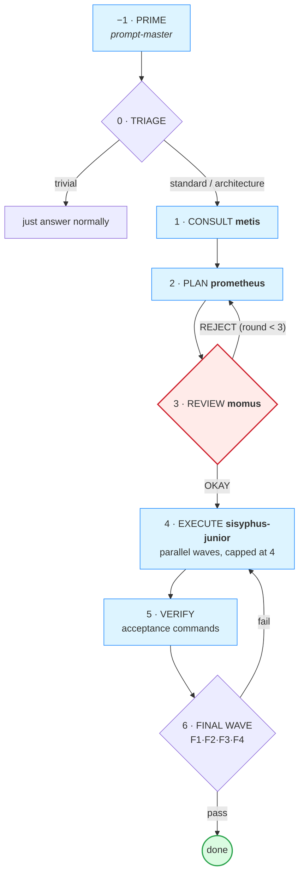
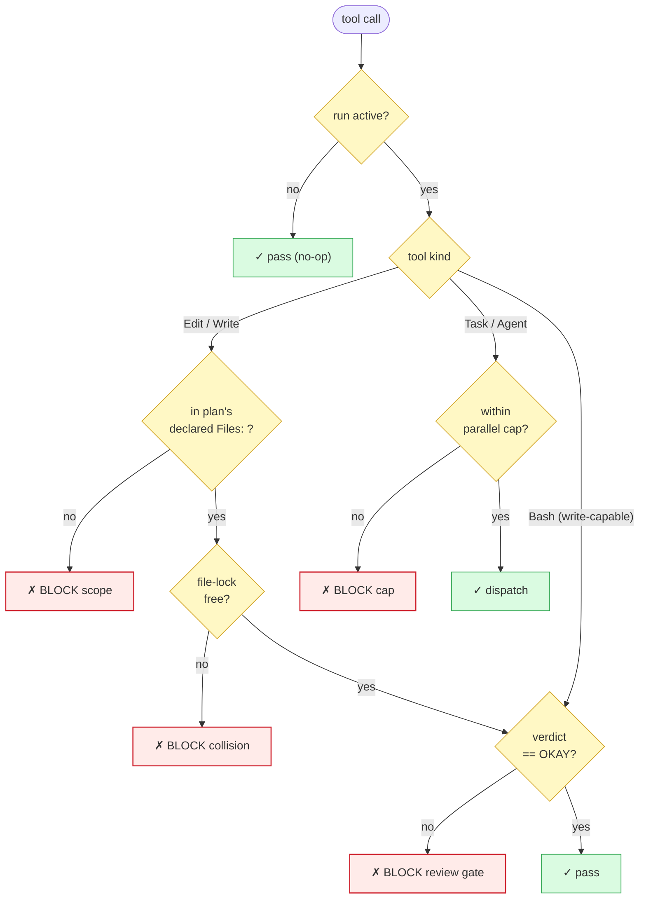
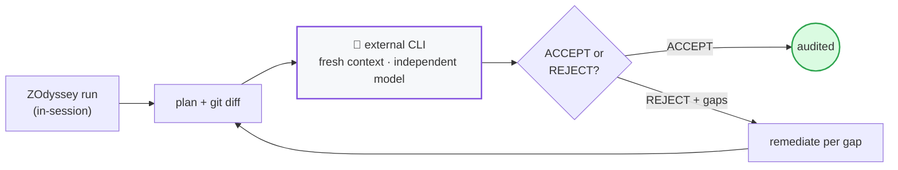

# ZOdyssey

> A hybrid-enforced multi-agent orchestration pipeline. The pattern is portable; the reference implementation targets [ZCode](https://z.ai).

**What if the "review the plan before executing" step in your agent pipeline was a hard gate, not a suggestion?**

That is the core idea. Most multi-agent orchestrators (including the excellent [**omo**](https://github.com/code-yeongyu/oh-my-openagent), which this project learned from) implement the review/approval gate as a prompt convention — the model is *told* not to edit before review passes, but nothing actually stops it. ZOdyssey code-enforces that gate with a hook, and adds a scope-isolation boundary so an executor can only touch files the plan declared. The full pipeline (prime → triage → consult → plan → review → execute → verify → final-wave) is the same shape omo and others use; the enforcement layer is the delta.

<p align="center">
  
</p>

*Both sides run the same pipeline. The right side just refuses to trust the model at the load-bearing invariant.*

---

## Two ways to use this repo

### 1. You just want the ideas (any harness)

Read [`docs/DESIGN.md`](docs/DESIGN.md) — it explains the hybrid-enforcement principle, the plan-file contract, the state/resume model, and every load-bearing decision with the research it is grounded in. Then read [`docs/ADAPT.md`](docs/ADAPT.md) for a concrete guide to porting the enforcement delta onto omo or any orchestrator that supports hooks (Claude Code, ZCode, Cursor, etc.). The source of the gate itself ([`skills/odyssey/hooks/pre-tool.mjs`](skills/odyssey/hooks/pre-tool.mjs)) is the reference implementation to crib from.

**If you are already an omo user, start there** — omo gives you the full pipeline, the agent cast, and the ergonomics. Then layer on the 4 enforcement hooks from [`docs/ADAPT.md`](docs/ADAPT.md). That is the highest-leverage path for most people.

### 2. You are on ZCode and want it ready-to-run

Install the reference implementation:

```bash
git clone https://github.com/amartinawi/zodyssey.git
cd zodyssey
node scripts/install.mjs            # copies into ~/.zcode/, registers hooks
```

Then start a new ZCode session and run, in any repo:

```
/orchestrate <your task>
```

Full install/troubleshooting/config in [`docs/INSTALL.md`](docs/INSTALL.md).

---

## The pipeline



*The conductor drives this state machine; every transition checkpoints to `state.json` so a crashed run resumes.* Full topology + agent roles in [`docs/diagrams.md`](docs/diagrams.md).

```
  -1  PRIME        prompt-master refines the raw task into a sharp brief
   0  TRIAGE       trivial → just answer; standard → single-track; architecture → full pipeline
   1  CONSULT      metis classifies intent, surfaces questions/risks
   2  PLAN         prometheus writes <repo>/.zcode/plans/<slug>.md  (cannot edit product code)
   3  REVIEW       momus returns OKAY | REJECT + blockers   ←  THE ENFORCED GATE
   4  EXECUTE      sisyphus-junior per todo, parallel-by-default, scope-locked to the plan's Files:
   5  VERIFY       run each todo's executable acceptance criteria
   6  FINAL WAVE   F1 plan-compliance · F2 code-quality · F3 manual-QA · F4 scope-fidelity
```

The orchestrator (main agent) drives this; the cast of sub-agents (`metis`, `prometheus`, `momus`, `sisyphus-junior`, plus read-only `explore`/`librarian`/`oracle`) does the work. The enforcement hooks in `~/.zcode/cli/config.json` hard-block the invariants.

## What the hooks enforce (the delta)



*First match wins; every other branch blocks.* Full decision tree (including the plan-tamper sha guard + the trusted-script allowlist) in [`docs/diagrams.md`](docs/diagrams.md).

| Invariant | How omo does it | How ZOdyssey does it |
|---|---|---|
| **No edits before plan passes review** | prompt convention | hook reads `state.json`; blocks the Edit |
| **Executor stays in declared scope** | not enforced | hook parses the plan's `Files:` union; blocks edits outside it. **Fails closed** on unreadable/empty plan |
| **No edit collisions between agents** | not enforced | hook checks a file-lock ledger |
| **Parallel dispatch within bounds** | not enforced | hook counts in-flight Tasks; blocks beyond cap (default 4) |
| **Bash write-escape before review** | n/a | hook gates write-capable Bash (`sed -i`, `>`, `git apply`, …) the same as Edit. Secure by default; `ZODYSSEY_UNGATE_BASH=1` disables |

All hooks are **NO-OP unless an orchestration run is active**. Normal ZCode editing is never affected. A run is "active" only between `/orchestrate` and reaching a terminal phase (`done`/`audited`/`abandoned`), and only inside the repo where you invoked it.

## The external consult gate (the strongest check)



After a run reaches `done`, `/orchestrate-consult <slug>` hands the plan + the full git diff to a **separate Claude CLI process** (fresh context, independent model) for an ACCEPT/REJECT audit. It cannot inherit the run's assumptions, so it catches things in-session reviewers miss. On REJECT, ZOdyssey sets `phase: remediate` (re-arming the gates) and loops until ACCEPT. See [`docs/DESIGN.md` §6.1](docs/DESIGN.md).

## Prerequisites

There are **two paths** and the prerequisites differ. Pick one, then install in the order listed.

### Path A — Adapt the enforcement delta onto another harness (omo, Claude Code, Cursor, …)

You already have an orchestrator and want to bolt on the 4 enforcement hooks. This is the porting path described in [`docs/ADAPT.md`](docs/ADAPT.md). Install in this order:

1. **An orchestrator with a hook system.** ZOdyssey's delta is `PreToolUse` / `PostToolUse` / `Stop` hooks that return `pass` or `block`. Your harness must run a script before tool calls and honor that decision. [omo](https://github.com/code-yeongyu/oh-my-openagent) (TypeScript), Claude Code, and ZCode all qualify.
2. **Node 18+** on the machine that runs the hooks. All ZOdyssey scripts are ESM `.mjs` using only Node built-ins (`fs`, `path`, `crypto`, `child_process`) — **zero npm dependencies**, so no `npm install` step.
3. **A `PreToolUse` hook registration mechanism.** You need a way to tell your harness "run `pre-tool.mjs` before `Write|Edit|ApplyPatch|MultiEdit|NotebookEdit|Bash|Task|Agent`." On ZCode this is `~/.zcode/cli/config.json`; on Claude Code it's `.claude/settings.json`; on omo it's the TS hook layer. See [`docs/ADAPT.md` § "Porting to omo specifically"](docs/ADAPT.md).
4. **A hook scripting language that can read JSON from stdin and exit with a code.** The reference implementation is Node; if your harness prefers Python or Bash, port the logic (it's ~200 lines) — the decision tree is what matters, not the language.

That's the full mandatory set for Path A. The 4 hooks are the entire delta; everything else (agent cast, pipeline shape, notepad pattern) comes from your existing orchestrator.

### Path B — Install the ready-to-run reference implementation on ZCode

You want the full ZOdyssey pipeline (conductors, sub-agents, slash commands) working out of the box. Install in this order:

1. **[ZCode](https://z.ai)** — the hooks, commands, and sub-agents are ZCode primitives. Start a ZCode session first; everything else installs into `~/.zcode/`.
2. **Node 18+** (for the hooks + scripts, all ESM `.mjs`).
3. **A coding model that follows multi-step instructions.** Developed against GLM-5.2 via the Z.ai coding plan. Claude / GPT / Gemini class models work too, as long as ZCode can dispatch them as sub-agents.
4. **Clone this repo and run the installer:**
   ```bash
   git clone https://github.com/amartinawi/zodyssey.git
   cd zodyssey
   node scripts/install.mjs            # copies into ~/.zcode/, registers 4 hooks + 5 MCPs
   node scripts/install.mjs --verify   # health-check: hooks parse, MCP backends resolvable
   ```
   The installer also registers the 5 pipeline MCPs (`memory`, `sequential-thinking`, `codegraph`, `chrome-devtools`, `zai-mcp-server`) — each gated on its backend being on PATH, skipped with a hint if not. It detects the [`superpowers`](https://github.com/obra/superpowers) plugin (source of most routed skills) and prints a pointer if missing. Full install / troubleshooting / config in [`docs/INSTALL.md`](docs/INSTALL.md).

### For LLM agents

If you are an LLM agent asked to install ZOdyssey, fetch the full install guide and follow it end to end:

```bash
curl -fsSL https://raw.githubusercontent.com/amartinawi/zodyssey/main/docs/INSTALL.md
```

The guide covers: the prerequisite check (Node 18+, a working ZCode session), the installer's six steps (copy skills/agents/commands → register 4 hooks → register 5 pipeline MCPs → merge AGENTS.md → init eval dir → detect superpowers), the `--verify` health check, and troubleshooting. Then run the installer itself (`git clone` + `node scripts/install.mjs`) and report the `--verify` output. Don't summarize the guide; read it end to end before doing anything.

### Optional — for specific features (graceful no-op if absent)

These are **not** required for the core pipeline. Each degrades honestly when missing:

- **`git`** — needed for the strongest verification features: the external consult audit (`/orchestrate-consult`) diffs the run against `git rev-parse HEAD`, and final-wave F1 (plan-compliance) is a `git diff --name-only` set-difference. Without git, the pipeline still runs to completion but consult works from the whole working tree and F1 fails-closed (run stays at `phase: final`, not `done`). Most users have git already.
- **A second CLI for the external consult gate** — `consult.mjs` and `judge.mjs` spawn an independent auditor (default binary: `claude`; override with `CLAUDE_CLI`). Set this if you want the `/orchestrate-consult` post-done audit or the eval harness's LLM-as-judge. Without it, the in-session review gate + final wave still run; you lose only the independent-model verification.
- **[codegraph](https://github.com/colbymchenry/codegraph)** — used by `codegraph-impact.mjs` to derive declared `Files:` from real call-graph impact, and by the explore step. Graceful no-op if no `.codegraph/` index is present in the target repo.
- **[`superpowers`](https://github.com/obra/superpowers)** — for the brainstorming / TDD / systematic-debugging skills the conductor reaches for. ZOdyssey works without it; you get the capsule versions of the three load-bearing skills (`tdd`, `debugging`, `executing-plans`) shipped in `references/capsules/` either way.
- **A second provider CLI** (e.g. a different model's `*-p` headless binary) — for `--multi-auditor` consult mode. Set `CLAUDE_CLI_2` to a different provider's CLI and the consult gate runs two independent passes, flagging disagreement.

## What it is NOT

- **Not a replacement for normal agent operation.** It is an opt-in mode entered via `/orchestrate`. Everything else is handled directly.
- **Not multi-model in v1.** The `category` routing field is designed in (see [DESIGN.md §8](docs/DESIGN.md)) but routing reduces to effort/variant selection within one connected model until you wire a second provider.
- **Not harness-agnostic in v1.** The reference implementation targets ZCode. The *pattern* is portable — see [`docs/ADAPT.md`](docs/ADAPT.md).
- **Not a team-mode orchestrator yet.** Parallel multi-executor (mailbox + worktrees) is designed but deferred to v2. v1 is single-executor-per-todo, dispatched in parallel waves.

## Project layout

```
zodyssey/
├── skills/odyssey/          # the conductor: SKILL.md + hooks/ + scripts/ + references/
│   ├── hooks/pre-tool.mjs   #  THE enforcement gate (the delta)
│   └── scripts/             # scaffold, parse-plan, set-phase, consult, record-*, harness, judge…
├── agents/                  # metis, prometheus, momus, sisyphus-junior, explore, librarian, oracle, multimodal-looker
├── commands/                # /orchestrate, /orchestrate-consult
├── docs/
│   ├── DESIGN.md            # the full design doc — read this first
│   ├── ADAPT.md             # porting the enforcement delta onto omo / any harness
│   ├── INSTALL.md           # detailed install + config + troubleshooting
│   └── ECOSYSTEM_GRAPH.md, MEASUREMENT.md, RESUME.md, deep-audit-prompt.md
├── examples/                # one anonymized example run
└── scripts/install.mjs      # the installer
```

## Provenance

ZOdyssey is a synthesis of published multi-agent systems research, not an invention. Every load-bearing decision maps to a finding from production systems — the [Anthropic multi-agent research post](https://www.anthropic.com/engineering/multi-agent-research-system), the [Building Effective Agents](https://www.anthropic.com/engineering/building-effective-agents) essay, [LangChain's multi-agent architecture analysis](https://www.langchain.com/blog/choosing-the-right-multi-agent-architecture), the [arXiv context-engineering paper](https://arxiv.org/html/2508.08322v1), and the [omo](https://github.com/code-yeongyu/oh-my-openagent) source (the pipeline shape and the agent cast are modeled on omo; the enforcement layer is the differentiator). Full citations in [DESIGN.md §0 + §15](docs/DESIGN.md).

## License

[MIT](LICENSE) — take it, adapt it, use it. If the enforcement-gate pattern makes your orchestrator more reliable, that is the whole point.
