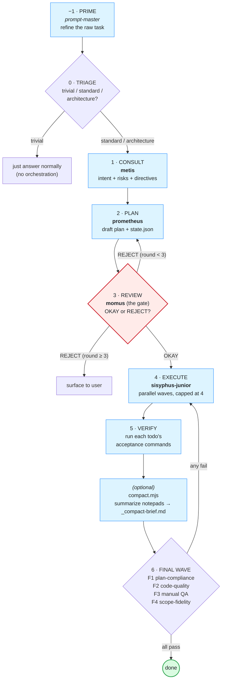
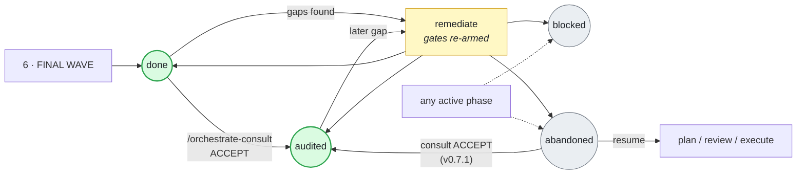
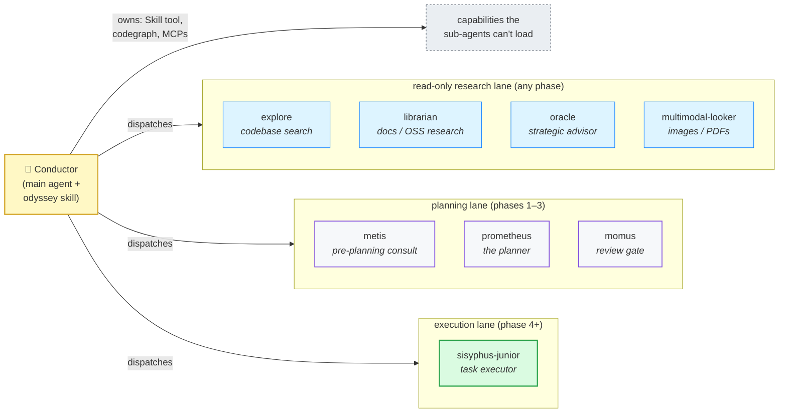
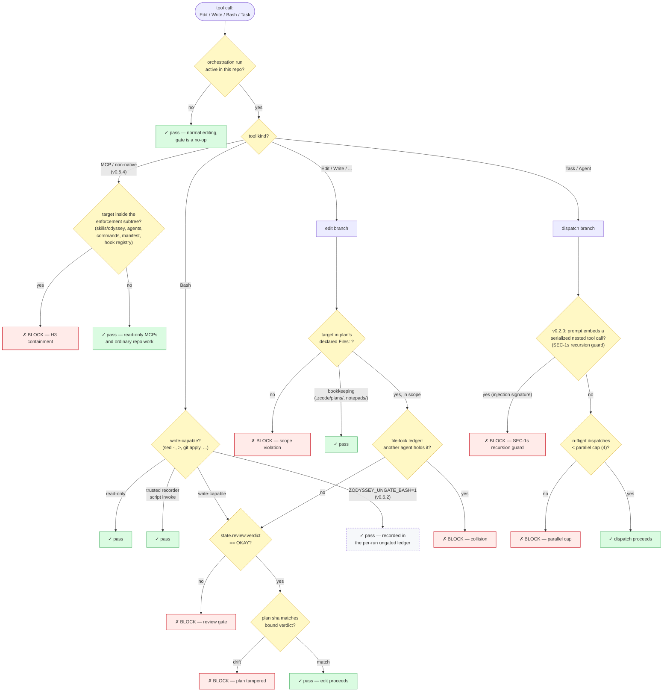
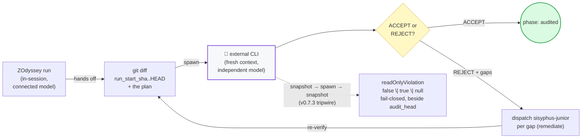
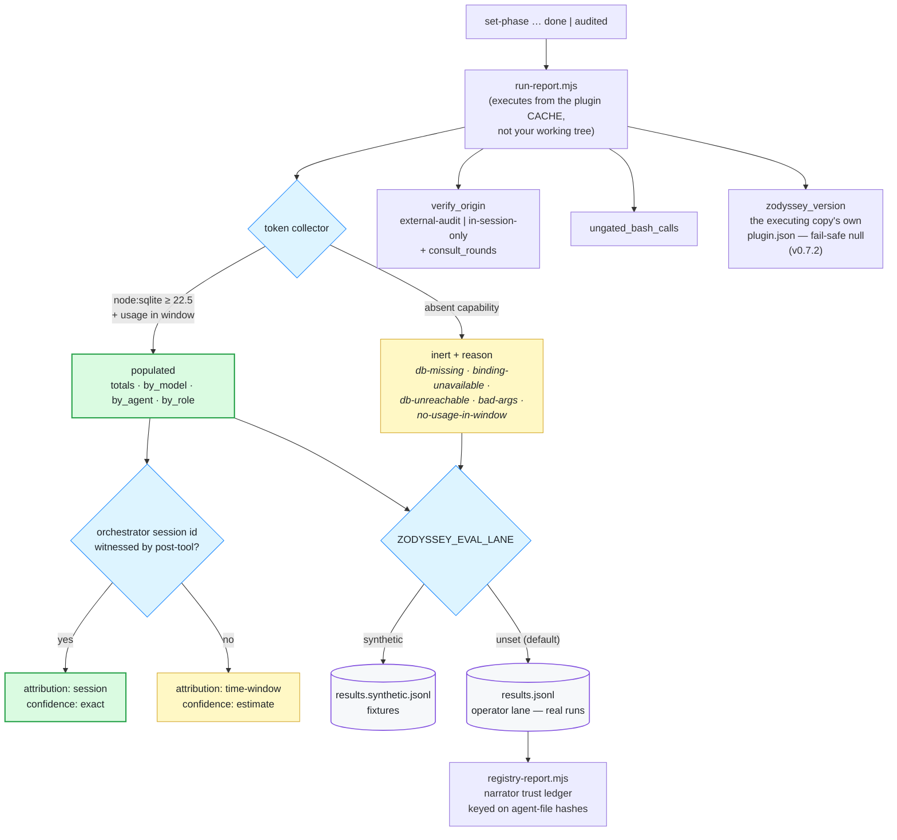

# Diagrams

Visual reference for ZOdyssey's architecture. All diagrams are [Mermaid](https://mermaid.js.org/) — they render natively on GitHub and in any Markdown viewer that supports it. Edit them as text; no build step.

The headline visual (the enforcement-delta idea) lives at [`assets/hero.svg`](../assets/hero.svg) and is embedded in the [README](../README.md).

---

## 1. The pipeline (8 phases)

The conductor drives this state machine. Every transition writes a checkpoint to `<repo>/.zcode/state/<slug>.json` so a crashed run can resume.

**v0.2.0 addition — optional compaction before final wave:** the orchestrator MAY run `scripts/compact.mjs <repo> <slug>` between verify and final wave to derive `_compact-brief.md` (a deterministic, $0 concatenation of the run's notepads, each truncated to ~40 lines). The F1–F4 sub-agents then consume the brief instead of the full notepad set, cutting final-wave context cost. Additive (source notepads are never modified); opt-in. Borrows prime-agent primitive #8.

**Key invariants enforced at the gate (phase 3):**
- The hook **blocks every product-code edit** until `state.review.verdict == OKAY`.
- The OKAY verdict is **non-forgeable** — bound to a nonce the hook minted when it witnessed the `Task(momus)` dispatch, plus the plan's sha256.
- A REJECT loop can run at most 3 rounds; the hook blocks further `momus` dispatches after that.

### 1b. Terminal phases and the escape hatches

`done` is not the last state. The phase graph in `set-phase.mjs` admits four terminal phases and two escape hatches, and the edges are enforced — an arbitrary transition is refused, not warned about.

- **`done` → `audited`** is the primary path that records an independent verdict. It is what `verify_origin: external-audit` means on the run record (v0.6.0).
- **`abandoned` → `audited`** (v0.7.1, queue item 26) serves the **audit vehicle**: a run opened purely to carry an external audit of already-shipped work executes nothing, so it could never reach `done` — it ended at `abandoned`, unable to wear the label it earned and contributing no trend record (the auto-append fires on `done`/`audited` only). The edge is gated on `consult.verdict === "ACCEPT"` — minted by `consult.mjs` alone, never `--force` — so the run class that most deserves `external-audit` labeling now produces it.
- **`remediate`** re-arms the enforcement hooks, which are otherwise disarmed after `done`, so gap-fixes run under the same gates the original work did.
- **`blocked` and `abandoned`** are the two `--force`-able targets (`set-phase.mjs:319`). `abandoned` can resume into `plan`/`review`/`execute` — and, since v0.7.1, transition to `audited` through the consult-ACCEPT gate above. The pre-v0.7.1 gap (tracked as candidate C1, shipped as row 26 in [`docs/impl/00-INDEX.md`](impl/00-INDEX.md)) is closed.

---

## 2. Agent topology

The conductor (main agent) drives; the cast of 8 sub-agents does the work. Read-only agents can run anytime; executors only in execute/verify/final.

**Why the conductor owns the Skill tool and MCPs:** ZCode sub-agents receive a fixed tool set (Bash/Edit/Read/Write/WebSearch + a couple of always-on MCPs) — they do **not** get the Skill tool, codegraph, or routed MCPs regardless of the agent file's `tools:` frontmatter (verified by smoke-test, documented in each agent). So the conductor loads skills and runs codegraph in its own thread, then passes the results into the sub-agent's dispatch prompt. This is the "trust anchor" that makes the dispatch model work.

---

## 3. The enforcement gate (PreToolUse decision tree)

This is the reference implementation of the delta. Read top-to-bottom: first match wins, every other branch blocks.

**The seven load-bearing invariants**, each mapped to a branch above:

| Invariant | Branch | Failure mode if absent |
|---|---|---|
| No edits before review passes | `VERDICT1` | executor ships code nobody approved |
| Executor stays in declared scope | `SCOPE` | executor edits an unrelated file |
| No edit collisions between agents | `LOCK` | two agents clobber the same file |
| Parallel dispatch within bounds | `PCAP` | runaway fan-out, 50 subagents |
| **No embedded-dispatch injection** (v0.2.0) | `REC` | a prompt-injected executor coerces a downstream agent into a forged nested `Task()` call |
| Bash write-escape before review | `BASH` | shell bypass of the Edit gate (`sed -i`, `>`) |
| **Non-native tools can't write the gate** (v0.5.4) | `MCP` | an MCP write rewrites `pre-tool.mjs` or the manifest from inside an approved run — the enforcement layer edits itself away |

The dashed `LEDGER` node is not a gate. `ZODYSSEY_UNGATE_BASH=1` is a deliberate operator escape hatch; since v0.6.2 every call taken through it is recorded in the run's ungated ledger and surfaced as `ungated_bash_calls` on the run record. The affordance stays; what changed is that using it is no longer invisible.

---

## 4. The external consult gate (independence)

The strongest verification: after a run reaches `done`, an **external CLI** (separate process, fresh context, different model) audits the plan + full diff. The auditor cannot inherit the run's assumptions.

**Why this is stronger than any in-session reviewer:** the auditor is a separate process — it has not seen the plan rationale, the consult debate, or the executor's self-justifications. It judges the diff against the plan cold. A sub-agent reviewer (even momus) shares the run's context; the external auditor does not.

**Since v0.7.3 the window is witnessed, not promised:** every auditor spawn is wrapped before/after by a two-git-read work-tree snapshot (`workTreeSnapshot`/`compareWorkTree` in `consult.mjs`); the tri-state `readOnlyViolation` — `false` (clean), `true` (any work-path change or HEAD move), `null` (fail-closed on unreadable git) — lands beside `audit_head` in consult history. A `true` warns on stderr naming both possible causes (the auditor OR a concurrent session committing mid-window) and never mutates the verdict, the exit code, or triggers a rerun: record, don't adjudicate. The plan-audit lane is stderr-only (it writes `state.plan_audit`, not history). Pinned by `consult.tripwire.test.mjs`.

**Honest limitation:** this fires only on `/orchestrate-consult` (opt-in) and only after the run reaches `done`. It needs a second provider's CLI installed (default `claude`; override with `CLAUDE_CLI`). The `--multi-auditor` mode runs two independent passes and flags disagreement.

---

## 5. The evidence lane (what a closed run leaves behind)

Added across v0.6.0–v0.6.3. Everything above decides whether work is *allowed*; this decides whether the record of it can be *trusted afterwards*. Each piece exists because a specific reading of the corpus turned out to be wrong.

**Why each branch exists:**

| Piece | Shipped | The reading it prevents |
|---|---|---|
| **Two-lane corpus** | v0.6.1 | 83.2% of the trend log was fixture runs. Any "our runs average N" claim was measuring the test suite. Fixtures now declare `ZODYSSEY_EVAL_LANE=synthetic` at source and land in a separate file |
| **Inert-with-reason** | v0.6.3 | five distinct failure conditions all returned bare `null`, so a healthy collector and a dead one produced identical records. The absence now names its cause, including the `node:sqlite` floor the `>=18` engines field hides |
| **Session-exact attribution** | v0.6.3 | usage was scoped by (repo × time window), so two concurrent runs in one repo each counted the other's tokens — two readers landed on 10.8M and 24.3M for the same run and neither was wrong |
| **`verify_origin`** | v0.6.0 | an externally audited run and a self-graded one were indistinguishable in the corpus, while the docs claimed the external auditor was the stronger check |
| **Narrator trust ledger** | v0.6.0 | reviewer verdicts were scored per-run and thrown away. Trust is now cross-run and keyed on agent-file content hashes, so editing a prompt starts a new record instead of inheriting the old one's reputation |
| **`ungated_bash_calls`** | v0.6.2 | the documented `ZODYSSEY_UNGATE_BASH=1` escape hatch left no trace, so a run that used it read exactly like one that did not |
| **`zodyssey_version`** | v0.7.2 | the version-named cache directory names the last marketplace Get while its contents track the last `--sync-cache`, so the only thing that could answer "which copy emitted this record?" answered it wrong exactly when it mattered. The record now answers — read self-relative from the executing copy's own manifest, fail-safe to `null` |

**The cache caveat.** `run-report.mjs` executes from the installed plugin cache, not your working tree — so a telemetry fix that stays in the dev tree changes nothing at close. Refresh the plugin (`--sync-cache`, then a marketplace Update on a version bump) before trusting a new record shape, and check `npm run smoke`, which compares the deployed version against the repo.
