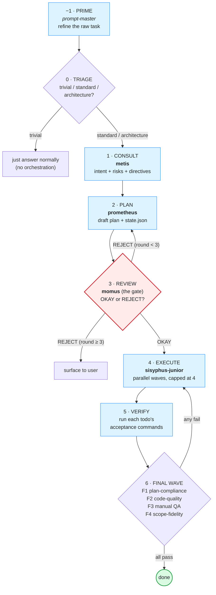
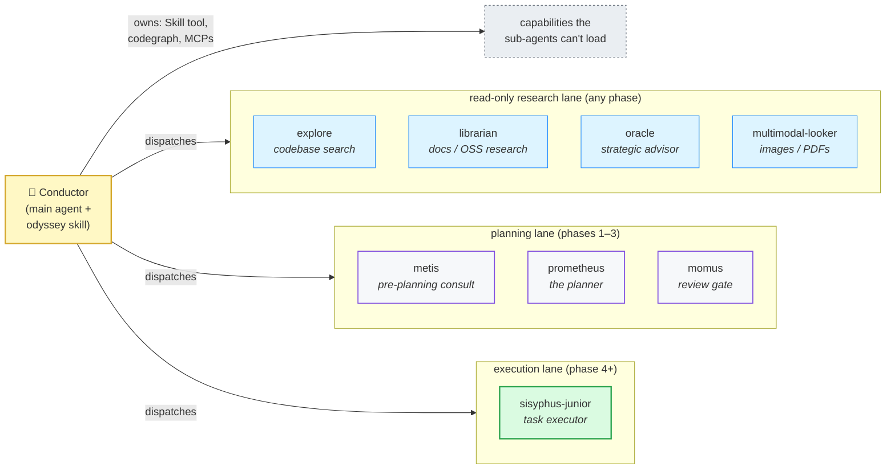
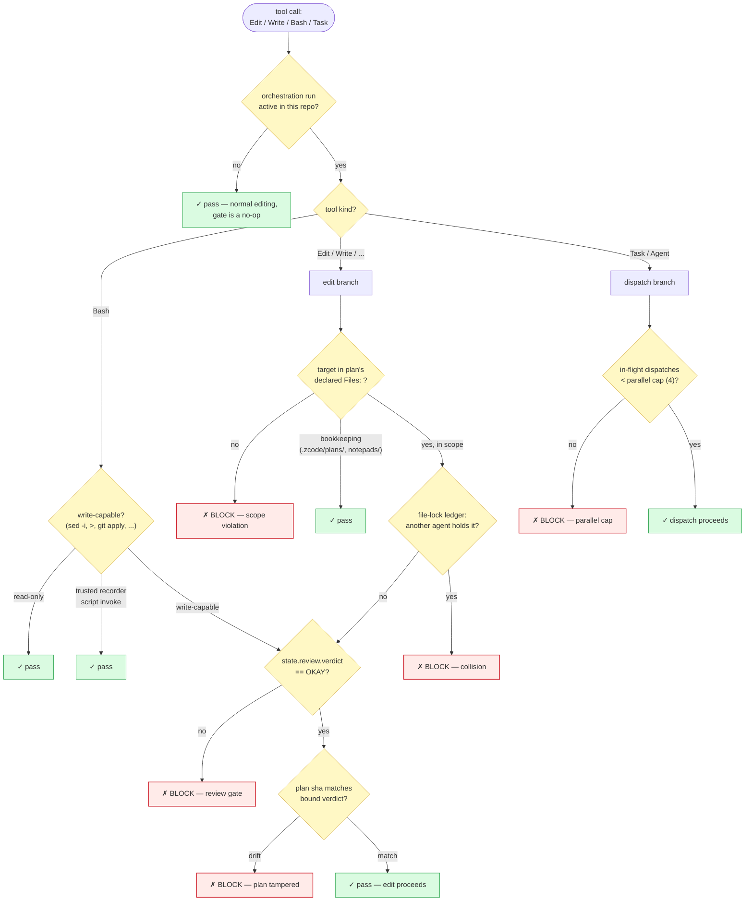
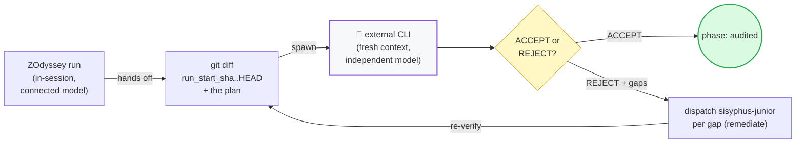

# Diagrams

Visual reference for ZOdyssey's architecture. All diagrams are [Mermaid](https://mermaid.js.org/) — they render natively on GitHub and in any Markdown viewer that supports it. Edit them as text; no build step.

The headline visual (the enforcement-delta idea) lives at [`assets/hero.svg`](../assets/hero.svg) and is embedded in the [README](../README.md).

---

## 1. The pipeline (8 phases)

The conductor drives this state machine. Every transition writes a checkpoint to `<repo>/.zcode/state/<slug>.json` so a crashed run can resume.

**Key invariants enforced at the gate (phase 3):**
- The hook **blocks every product-code edit** until `state.review.verdict == OKAY`.
- The OKAY verdict is **non-forgeable** — bound to a nonce the hook minted when it witnessed the `Task(momus)` dispatch, plus the plan's sha256.
- A REJECT loop can run at most 3 rounds; the hook blocks further `momus` dispatches after that.

---

## 2. Agent topology

The conductor (main agent) drives; the cast of 8 sub-agents does the work. Read-only agents can run anytime; executors only in execute/verify/final.

**Why the conductor owns the Skill tool and MCPs:** ZCode sub-agents receive a fixed tool set (Bash/Edit/Read/Write/WebSearch + a couple of always-on MCPs) — they do **not** get the Skill tool, codegraph, or routed MCPs regardless of the agent file's `tools:` frontmatter (verified by smoke-test, documented in each agent). So the conductor loads skills and runs codegraph in its own thread, then passes the results into the sub-agent's dispatch prompt. This is the "trust anchor" that makes the dispatch model work.

---

## 3. The enforcement gate (PreToolUse decision tree)

This is the reference implementation of the delta. Read top-to-bottom: first match wins, every other branch blocks.

**The five load-bearing invariants**, each mapped to a branch above:

| Invariant | Branch | Failure mode if absent |
|---|---|---|
| No edits before review passes | `VERDICT1` | executor ships code nobody approved |
| Executor stays in declared scope | `SCOPE` | executor edits an unrelated file |
| No edit collisions between agents | `LOCK` | two agents clobber the same file |
| Parallel dispatch within bounds | `PCAP` | runaway fan-out, 50 subagents |
| Bash write-escape before review | `BASH` | shell bypass of the Edit gate (`sed -i`, `>`) |

---

## 4. The external consult gate (independence)

The strongest verification: after a run reaches `done`, an **external CLI** (separate process, fresh context, different model) audits the plan + full diff. The auditor cannot inherit the run's assumptions.

**Why this is stronger than any in-session reviewer:** the auditor is a separate process — it has not seen the plan rationale, the consult debate, or the executor's self-justifications. It judges the diff against the plan cold. A sub-agent reviewer (even momus) shares the run's context; the external auditor does not.

**Honest limitation:** this fires only on `/orchestrate-consult` (opt-in) and only after the run reaches `done`. It needs a second provider's CLI installed (default `claude`; override with `CLAUDE_CLI`). The `--multi-auditor` mode runs two independent passes and flags disagreement.
